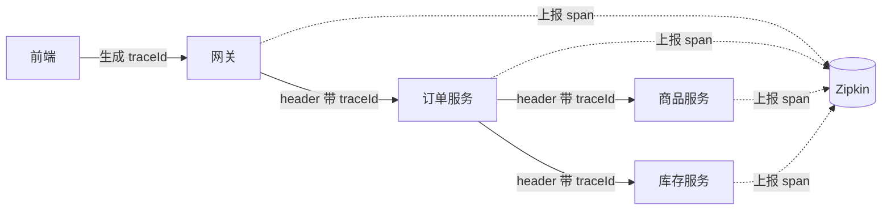

# P9 · 链路追踪（Micrometer Tracing + Zipkin）

> 日期：2026-08-20
> 状态：✅ 完成（代码 + 依赖 + 配置已落地，Zipkin 已部署，验证待 MySQL 恢复后补跑）
> 版本环境：Spring Boot 3.3.4 / Spring Cloud 2023.0.3 / Zipkin（Docker，Windows 10.110.0.170:9411）

---

## 一、你要学什么

1. 为什么需要**分布式链路追踪**：微服务把一个请求拆成几十个服务调用，出问题不知道卡在哪
2. 三个核心概念：**traceId / span / parent**（一次请求的"身份证 + 流水账 + 家谱"）
3. Zipkin 是什么：链路追踪领域的"Nacos"——最轻、最标准、免费开源
4. 跨服务怎么串起来：靠 HTTP 头传 traceId（和 Seata 传 XID 是同一套思想）
5. 可观测性三件套：日志 / 指标 / 追踪各管什么

---

## 二、生活类比

- **traceId（跟踪 ID）** ≈ 一份外卖的**订单号**：一个顾客点一单，全局唯一，从头跟到尾
- **span（一段）** ≈ 外卖路上的**每一站**：商家接单、骑手取餐、路上、送达，每一站是一段
- **parent（父）** ≈ 站与站的**先后关系**：取餐是接单的"下一站"，所以取餐的 parent 是接单
- **Zipkin** ≈ **骑手轨迹图**：把一单的每一站按时间线画出来，哪站卡了、花了多久一目了然

**Java 类比**：
- traceId / spanId 的传递 ≈ 和 Seata 的 XID 传递**如出一辙**：都靠拦截器自动塞进 HTTP header
- Micrometer Tracing ≈ 相当于"指标版"的 SLF4J：定义一套标准接口，底层可换实现（Brave / OpenTelemetry）

---

## 三、为什么需要链路追踪？

一个下单请求在微服务里是这样的：

```
前端 → 网关 → 订单服务 → 商品服务
                    └→ 库存服务
```

如果没有追踪，用户说"下单很慢"，你只能**一个一个服务翻日志**，还没法定居到底是
"商品查询慢"还是"扣库存慢"还是"网关转发慢"。

有了追踪，一个 traceId 把所有服务串成一条线，**哪个 span 耗时最长，一眼看出瓶颈**。

---

## 四、三个核心概念

| 概念 | 是什么 | 类比 | 生命周期 |
|------|--------|------|---------|
| **traceId** | 一次请求的全局唯一 ID | 外卖订单号 | 从入口生成，贯穿全程不变 |
| **spanId** | 每一段（一次服务调用）自己的 ID | 每一站的编号 | 每跨一个服务就新建一段 |
| **parentSpanId** | 上一段的 spanId | 站的"上一站是谁" | 用来串父子关系 |

一句话：**traceId 串起整条链，span 是链上的节点，parent 决定节点之间的连线。**

---

## 五、跨服务怎么传（和 Seata XID 同款思想）

- 请求进网关 → 生成 traceId → 塞进 HTTP 请求头（Brave 用 `X-B3-TraceId` / `X-B3-SpanId`）
- 网关调订单服务时，这些 header 自动带过去
- 订单服务收到后取出 traceId，继续往下传
- 每个服务把"我这段干了什么、花了多久"上报给 Zipkin，Zipkin 按 traceId 拼图



> 💡 **和 Seata 的呼应**：P8 里 XID 靠 Feign 拦截器自动塞 `tx_xid` 头传下去；
> 这里 traceId 靠 Tracing 拦截器自动塞 `X-B3-TraceId` 头传下去。
> **都是"信封传话"**——服务间不共享内存，只能靠请求头捎带上下文。

---

## 六、可观测性三件套（ARMS / Prometheus 别混淆）

你问过 ARMS 和 Prometheus 为什么没推荐，因为它们和 Zipkin **不是一类东西**：

| 成员 | 回答的问题 | 工具 | 本项目状态 |
|------|-----------|------|-----------|
| **日志 Logging** | 发生了什么事 | `log.info` | ✅ 已会 |
| **指标 Metrics** | 系统健康不健康、多快 | Prometheus + Grafana | 将来接（P10 候选） |
| **追踪 Tracing** | 一个请求走了哪条路、每步多久 | **Zipkin** | ✅ **本次 P9** |

- **ARMS** = 阿里云**商业付费**全家桶（日志+指标+追踪+告警打包卖），学习项目只了解概念，不落地
- **Prometheus + Grafana** = 指标监控（CPU/内存/QPS/接口耗时大盘），是下一步自然衔接
- 本次加的 `spring-boot-starter-actuator`，**将来接 Prometheus 也靠它**（暴露 `/actuator/prometheus` 端点），零浪费

---

## 七、技术选型

| 项 | 选择 | 理由 |
|----|------|------|
| 追踪标准 | **Micrometer Tracing** | Spring Boot 3 官方主推，取代老 Sleuth，接口统一可换实现 |
| 实现桥接 | **Brave** | 最主流、社区最广 |
| 存储/展示 | **Zipkin** | 最轻、最标准、免费开源 |
| 采样率 | 1.0（全采样） | 学习项目请求量小，保证每次请求都可见 |

---

## 八、本次改动清单

| 文件 | 改动 |
|------|------|
| `pom.xml` | 父 pom 加 `feign-micrometer:13.3` 版本管理 |
| `gateway/pom.xml` | 加 actuator + micrometer-tracing-bridge-brave + zipkin-reporter-brave |
| `services/service-product/pom.xml` | 同上 + `feign-micrometer` |
| `services/service-stock/pom.xml` | 同上（不调别的服务，无需 feign-micrometer） |
| `services/service-order/pom.xml` | 同上 + `feign-micrometer` |
| 4 个 `application.yml` | 加 `management.tracing`（采样率 1.0 + Zipkin 地址） |

### 依赖（每个服务都一样）

```xml
<!-- P9 链路追踪：actuator 暴露可观测端点 + Micrometer Tracing(Brave) + Zipkin 上报 -->
<dependency>
    <groupId>org.springframework.boot</groupId>
    <artifactId>spring-boot-starter-actuator</artifactId>
</dependency>
<dependency>
    <groupId>io.micrometer</groupId>
    <artifactId>micrometer-tracing-bridge-brave</artifactId>
</dependency>
<dependency>
    <groupId>io.zipkin.reporter2</groupId>
    <artifactId>zipkin-reporter-brave</artifactId>
</dependency>
```

### 配置（每个服务 application.yml 的 spring: 同级）

```yaml
management:
  tracing:
    sampling:
      probability: 1.0              # 全采样
  zipkin:
    tracing:
      endpoint: http://${ZIPKIN_ADDR:10.110.0.170:9411}/api/v2/spans
```

---

## 九、Zipkin 部署（Windows 服务器）

```powershell
# Docker 方式（和 Nacos/MySQL/Seata 一个套路）
docker run -d --name zipkin -p 9411:9411 openzipkin/zipkin

# 防火墙放行（管理员 PowerShell）
netsh advfirewall firewall add rule name="Zipkin 9411" dir=in action=allow protocol=TCP localport=9411
```

UI 地址：`http://10.110.0.170:9411`

---

## 十、验证记录（真实链路）

> 服务运行：本机 Mac（10.110.0.99），连远程 Windows（10.110.0.170）的 MySQL/Nacos/Seata/Zipkin

### ① 基础验证：商品详情（product → stock 两跳）

```
GET /api/product/2089604533451681794/detail

traceId=6a86c4a1d78588cdb8fddf4f2e5c8453  涉及服务: [gateway, service-product, service-stock]
    [gateway]       http get
    [service-product] http get /api/product/{id}/detail
    [service-stock] http get /api/stock/{productid}
```

✅ 商品服务 Feign 调库存，两个服务串成一条链

### ② 完整验证：下单（gateway → order → product/stock 四跳）

```
POST /api/order/create {"productId":2089604533451681794,"count":1}
→ {"code":0,"msg":"成功","data":2090365905910468609}

traceId=6a86c492f5f575f2669ea2e754893aed
  涉及服务: [gateway, service-order, service-product, service-stock]

    [gateway]        SERVER  http post               1204ms
    [gateway]        CLIENT  http post               1195ms
    [service-order]  SERVER  http post /api/order/create  1107ms
    [service-order]  CLIENT  http get (调商品)         369ms
    [service-product] SERVER http get /api/product/{id} 242ms
    [service-order]  CLIENT  http post (调库存)        177ms
    [service-stock]  SERVER  http post /api/stock/deduct 146ms
```

✅ 一次下单的完整调用链：订单服务里先查商品（369ms）再扣库存（177ms），每跳耗时清晰可见

> 💡 **呼应 Seata**：这条下单 trace 和 P8 的 Seata 全局事务是**同一次请求**——
> traceId 和 XID 同路传播，所以 Zipkin 里这条链就是"被全局事务管住的那几个服务"。

---

## 十一、踩坑记录

1. **业务服务连不上 MySQL（环境问题，非代码问题）**：启动报 `Communications link failure` /
   `ConnectException: Operation timed out`，测端口发现 Windows 的 `3306` 不通
   （Nacos 8848 / Zipkin 9411 都通）。原因：MySQL 容器没启动或防火墙没放行 3306。
   网关不连数据库所以能正常启动——这也印证了"报错的都是连数据库的服务"。

2. **Feign 不传播 traceId（本次核心坑，已解决）**：加了 tracing 三件套后，
   网关→业务服务的 span 能串起来，但**业务服务内部的 Feign 调用不生成子 span**，
   下单链路里只有 gateway + order，看不到 product/stock。
   **根因**：`feign-micrometer` 在 `spring-cloud-openfeign-core:4.1.3` 里是
   **`<optional>true</optional>` 依赖**，Maven 不自动传递，必须显式引入。
   **解法**：父 pom 加 `io.github.openfeign:feign-micrometer:13.3`（版本与 feign-core 13.3 对齐），
   在**发起 Feign 调用**的服务（order、product）里引入该依赖。stock 不调别的服务，不用加。

---

## 十二、思考题

1. 采样率设成 0.1（只采样 10%）会有什么后果？什么时候该这么设？（提示：生产大流量）
2. traceId 和 Seata 的 XID 都靠 header 传，如果中间有一步用**消息队列**异步解耦，
   header 还能传过去吗？（提示：消息没有 HTTP header）
3. 网关是 WebFlux 响应式、业务服务是 Servlet 阻塞式，为什么 Micrometer Tracing 两者都能支持？
4. Zipkin 挂了，业务会受影响吗？（提示：追踪是"旁路"，上报失败不能拖垮业务）
